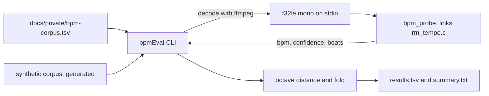

# BPM accuracy: how well does the estimator do, and when should it decline?

Plan 7 of the [Overview](Overview.md). Two questions, and plan 8 needs both
answered before it can decide what to store: **how often does the shipped tempo
estimator get a track right, and is there a confidence below which it should
refuse to guess at all?**

This is not a test suite. Nothing here passes or fails. There is a number, and
the harness exists so that the number is comparable between runs and so that it
getting worse is visible.

**Verdict, on synthetic material only: 97.6% octave-agnostic accuracy, and no
usable confidence threshold.** Aubio's confidence turned out to be slightly
*anti*-correlated with correctness here, which is a finding rather than a
number to apply. Plan 8 should not gate on confidence until this is re-run
against real music.

Plan 8 has since acted on both findings and added two sections at the end of
"What the run found": [the sample rate](#the-sample-rate-settled), which it
settled by measurement, and [what two-window agreement does on real
music](#what-two-window-agreement-does-on-real-music), which is the gate it
built instead of a confidence threshold.

## The caveat, before the figures

Everything below was measured on generated audio. There is no real corpus yet.

Synthetic material is easier than real music in every way that matters: the
beats land exactly where they claim to, the tempo never drifts, no performer
pushes or drags, and nothing else in the spectrum competes with the beat. **The
accuracy figure is therefore optimistic and should not be quoted as the app's
accuracy.**

What it is good for is real enough to be worth having. The harness runs
end to end today, on a laptop with no music on it. A regression in the estimator
shows up immediately as a changed number rather than as nothing at all. And it
already produced two findings that do not depend on the corpus being easy, in
[What the run found](#what-the-run-found).

Adding real tracks needs no code change; see
[Adding real music](#adding-real-music).

## How it is measured



The estimate comes out of [`bpm_probe`](../../aubio/tools/bpm_probe.c), a
subprocess that links the same [`rm_tempo.c`](../../aubio/src/main/cpp/rm_tempo.c)
the phone runs. That is the point of the split: measuring a second
implementation would measure agreement between two programs rather than the
accuracy of the one that ships. Everything else — the manifest, the hashing,
the scoring and the report — is Kotlin in `:cadence`.

### Three ways of being right

| | What it asks |
|---|---|
| **strict** | Is this the literal tempo, within 4%? |
| **octave** | Is it within 4% of the truth *or* of half or double it? |
| **played** | Would the track actually be played at the right speed? |

Strict is the figure the tempo-estimation literature reports, kept only so ours
are comparable with published ones. It is the wrong measure for this app:
reporting 85 for a 170 BPM track is the classic tempo-detector failure, but
playback speed is chosen by folding the tempo by powers of two, so 85 and 170
produce identical music. **Octave is the number that means anything.**

Played is harsher than either, and is the reason the scoring lives in `:cadence`
rather than being reimplemented. It runs the shipped
[`fold`](../../cadence/src/main/kotlin/lol/alphaliu01/runningmusic/cadence/Fold.kt),
so it inherits the clamp to reachable steps-per-beat exponents. An estimate at
four times the truth is octave-correct and still folds to a different speed,
which the runner hears. Only the real function knows that.

### The synthetic corpus

Eighty-five tracks: seventeen tempos from 60 to 200 BPM across five characters.
Generated from a fixed seed with a fixed algorithm, so it is identical on every
machine and in every run.

| Variant | What makes it hard |
|---|---|
| `click` | Nothing. The plan 6 stimulus and the easy case. |
| `backbeat` | Kick on 1 and 3 against a brighter burst on 2 and 4. |
| `sparse` | Events on 1 and 3 only, which invites the half-tempo reading. |
| `swung` | Offbeats pushed late, so the intervals alternate long-short. |
| `padded` | Clicks over a sustained drone, so the spectrum holds steady energy that is not the beat. |

The tempos cluster deliberately at 120, 125, 128 and 130, because that is where
a small tempo error most easily moves a track to a different playback speed, and
they include the 85/170 pair that halving confuses.

Every variant carries a quiet noise floor at about −60 dBFS. That is not
decoration, and plan 6 paid for the lesson: aubio discards any beat it predicts
inside a hop quieter than −90 dBFS, so with digital silence between clicks most
correctly predicted beats are thrown away and the tempo comes out several times
too slow.

## What the run found

85 synthetic tracks, whole-track analysis, 44100 Hz, buffer 1024, hop 512,
scored against a target cadence of 170 spm.

| | n | octave | strict | played | unknown |
|---|---|---|---|---|---|
| **everything** | 85 | **97.6%** | 76.5% | 91.8% | 0 |
| backbeat | 17 | 100.0% | 88.2% | 94.1% | 0 |
| click | 17 | 100.0% | 88.2% | 94.1% | 0 |
| padded | 17 | 100.0% | 88.2% | 94.1% | 0 |
| sparse | 17 | 94.1% | 35.3% | 88.2% | 0 |
| swung | 17 | 94.1% | 82.4% | 88.2% | 0 |

The estimator never declined to answer. Only two tracks were genuinely wrong,
both at 60 BPM: `sparse-060` and `swung-060` were each read at about 91 BPM,
which is neither the tempo nor an octave of it.

### Sparse behaves exactly as designed, and that validates the metric

Sparse scores 35.3% strict and 94.1% octave, the widest gap of any variant. Its
eleven strict failures are all the same failure: it reports half the tempo,
because with events only on 1 and 3 that is a perfectly reasonable reading of
the signal.

```
sparse-170     truth 170.00  estimate  85.83
sparse-150     truth 150.00  estimate  75.58
sparse-128     truth 128.00  estimate  63.88
```

Under the strict metric this variant looks broken. Under the octave metric it is
nearly perfect, and the octave metric is right: the app would play every one of
those tracks correctly.

### The five "played wrongly" tracks are the fold's doing, not the estimator's

Every track that was octave-correct but would play at the wrong speed is at
exactly 120 BPM:

```
backbeat-120   truth 120.0  estimate 121.6
click-120      truth 120.0  estimate 121.6
padded-120     truth 120.0  estimate 121.6
sparse-120     truth 120.0  estimate  60.4
swung-120      truth 120.0  estimate 121.7
```

At a cadence of 170, `log2(170 / 120)` is 0.5025. The fold rounds that to one
step per beat, but it sits **0.17% of tempo past the midpoint**. Any estimate
above about 120.2 BPM rounds the other way and the track plays at nearly double
the speed. A 1.3% tempo error — which is a good estimate by any standard —
crosses it.

This is the Overview's "120–130 BPM trap" appearing exactly where the maths says
it should, and it belongs to plan 9 rather than to plan 8. The estimator is not
at fault; the tempo is genuinely ambiguous at that cadence, and the queue needs
hysteresis or a tie-break near fold midpoints rather than a better tempo.

### Confidence does not separate right answers from wrong ones

This is the finding plan 8 most needs, and it is a negative one.

```
mean confidence when right 1.744, when wrong 2.078
```

The two wrong answers were *more* confident than the average correct one.
Sweeping the threshold across the whole observed range (1.008 to 2.726) buys
nothing: accuracy stays flat around 97% while coverage falls away, and above a
threshold of 1.74 it gets worse before it gets better.

| threshold | kept | coverage | accuracy |
|---|---|---|---|
| 0.000 | 85 | 100.0% | 97.6% |
| 1.497 | 71 | 83.5% | 97.2% |
| 1.744 | 39 | 45.9% | 94.9% |
| 1.812 | 28 | 32.9% | 92.9% |
| 2.339 | 8 | 9.4% | 87.5% |

**Recommendation: do not gate on confidence yet.** Not "use zero" — the harness
reports zero because accepting everything already clears the 95% target, and on
material this easy that says more about the corpus than about the estimator. Two
wrong answers is not enough evidence to fit a threshold to, and what evidence
there is points the wrong way.

Plan 8 should store every tempo the estimator returns, and re-run this against
real music before adding a confidence gate. If aubio's confidence turns out to
carry no signal there either, the honest design is to gate on something else —
beat count, or agreement between two analysis windows — rather than on a number
that does not mean what its name suggests.

### What a shorter analysis window costs

Plan 8 intends to analyse a window from the middle of each track rather than
whole files, so it is worth knowing the price. Analysing 10 seconds instead of
the full 30:

| window | octave | strict | played |
|---|---|---|---|
| whole track (30 s) | 97.6% | 76.5% | 91.8% |
| 10 s from the middle | 92.9% | 76.5% | 87.1% |

Just under five points of octave accuracy for a third of the audio. Re-measure
this at the window length plan 8 actually picks, and on real tracks, where 60 to
90 seconds out of five minutes is a much smaller fraction than 10 out of 30.

### The sample rate, settled

Plan 8 decodes on a phone, so halving the sample rate halves the decoding. The
question was what it costs. Measured at a 45-second window:

| rate | hop | hop length | octave | strict | played |
|---|---|---|---|---|---|
| 44100 | 512 | 12 ms | 97.6% | 76.5% | 91.8% |
| 22050 | 512 | 23 ms | 96.5% | **32.9%** | 84.7% |
| 22050 | 256 | 12 ms | 97.6% | 76.5% | 91.8% |

**22050 with a 256-sample hop is free.** It ties 44100 exactly on all three
metrics, for half the audio decoded and half the audio analysed, so that is what
[`AnalysisConfig`](../../app/src/main/java/lol/alphaliu01/runningmusic/analysis/BpmAnalyser.kt)
and [`AubioTempoAnalyser`](../../app/src/main/java/lol/alphaliu01/runningmusic/analysis/AubioTempoAnalyser.kt)
now use.

The middle row is the interesting one, and the reason this was worth measuring
rather than assuming. Dropping the sample rate while keeping the hop at 512
samples collapses strict accuracy by 44 points. Nothing was lost from the audio
that a beat lives in — a beat is nowhere near 11 kHz. What was lost is *time
resolution*: a hop is the finest interval at which a beat can be placed, and at
23 ms the tracker can no longer tell 130 BPM from 133. **A hop is a unit of time,
not of samples**, and halving the rate means halving the hop to keep it.

Note that octave accuracy barely moved even in that bad configuration, which is
a reminder of how forgiving the octave metric is and why `played` is the number
worth watching.

### What two-window agreement does on real music

The synthetic corpus cannot test the agreement gate, because a synthetic track
is the same throughout by construction and always agrees with itself. Four real
tracks, on device, at the settings above:

| track | first 45 s | second 45 s | outcome |
|---|---|---|---|
| Haddaway, *What Is Love* | 125.76 | 125.72 | stored |
| Jim Croce, *Workin' At The Car Wash Blues* | 135.01 | 136.00 | stored |
| 摇滚大鼓李亮节, *红夏利与黄大发* | 191.93 | 191.81 | stored |
| Hank Williams III, *Six Pack Of Beer* | 155.65 | 103.23 | **refused** |

The three that agree do so to within a tenth of a percent, and the one that
disagrees does so by a factor of exactly 3:2. That last track really runs at
about 310 BPM by hand count, so the first window found half-time and the second
locked onto every third beat — the shuffle underneath fast bluegrass playing.

This is the case the gate exists for, and it is worth being precise about why.
**Octave folding repairs errors by factors of two and can never repair a factor
of three.** Storing 103 for a track that folds to 155 would have played it at
two thirds of the intended speed, which a runner feels immediately. A confidence
threshold would not have caught it either: the *wrong* window was the more
confident one, 0.39 against 0.16, which is the anti-correlation of the section
above showing up again on real music the first time it was asked to.

One refusal in four is too small a sample to call a refusal rate. It does
establish that the gate fires on genuinely ambiguous material rather than at
random, which was the open question.

## Re-running it

```bash
scripts/bpm-eval.sh
```

Builds the host binaries first, so the number always comes from current source,
then runs the synthetic corpus. Takes a few seconds. Useful options:

```bash
scripts/bpm-eval.sh --analyse-seconds 60      # only the middle minute
scripts/bpm-eval.sh --cadence 180             # a different target cadence
scripts/bpm-eval.sh --help                    # the full set
```

Two files land in `aubio/build/bpm-eval`:

- `results.tsv`, one row per track in a fixed sort order, with no timestamp
  anywhere. Two runs of the same corpus produce byte-identical files, so a diff
  between them means the estimator changed and nothing else.
- `summary.txt`, also printed, carrying a header that records the commit, the
  sample rate, the hop and buffer, the synthetic seed and the manifest hash.
  Without that a pair of reports is two numbers with no way to tell why they
  differ.

## Adding real music

No code change is needed. Put the audio anywhere, add a row per track to
[`bpm-corpus.tsv`](bpm-corpus.tsv), and point the harness at the directory:

```bash
sha256sum ~/Music/bpm-corpus/some-track.flac
# add the row, then
scripts/bpm-eval.sh --corpus ~/Music/bpm-corpus
```

Audio is never committed; only the manifest is. Each row records the file's
hash, which is what makes two runs comparable — replacing a track with a
different rip would otherwise change the reported number invisibly. A mismatch
is reported loudly and the track skipped; a file that is simply not on this
machine is skipped quietly.

Ground truth is recorded with its provenance, one of `tapped`, `tag` or
`published`. This distinction is worth keeping: a tempo read out of a file's own
BPM tag was very likely written by another detector, and grading a detector
against a detector is not the experiment anyone meant to run. Prefer `tapped`.

Fifty tracks would be worth more than the eighty-five synthetic ones. Weight
them towards what the app is for — music people actually run to — and include
the awkward cases on purpose: live drumming, tracks with a long ambient intro,
anything with a tempo change, and anything near 120 BPM, since that is where the
fold is most fragile.

## Where the pieces live

| | |
|---|---|
| Probe | [`aubio/tools/bpm_probe.c`](../../aubio/tools/bpm_probe.c) |
| Scoring | [`cadence/.../accuracy/BpmAccuracy.kt`](../../cadence/src/main/kotlin/lol/alphaliu01/runningmusic/cadence/accuracy/BpmAccuracy.kt) |
| Confidence sweep | [`cadence/.../accuracy/ConfidenceSweep.kt`](../../cadence/src/main/kotlin/lol/alphaliu01/runningmusic/cadence/accuracy/ConfidenceSweep.kt) |
| Corpus and manifest | [`cadence/.../accuracy/Corpus.kt`](../../cadence/src/test/kotlin/lol/alphaliu01/runningmusic/cadence/accuracy/Corpus.kt), [`SyntheticCorpus.kt`](../../cadence/src/test/kotlin/lol/alphaliu01/runningmusic/cadence/accuracy/SyntheticCorpus.kt) |
| CLI | [`cadence/.../cli/BpmEval.kt`](../../cadence/src/test/kotlin/lol/alphaliu01/runningmusic/cadence/cli/BpmEval.kt) |
| Wrapper | [`scripts/bpm-eval.sh`](../../scripts/bpm-eval.sh) |

The scoring and the sweep are in `main` because they are the shipped `fold`'s
neighbours and plan 8 may use them. The corpus, the CLI and the probe driver are
in `test`, beside `BpmSurvey.kt` and `RecordingSummary.kt`, so they never reach
a phone.
