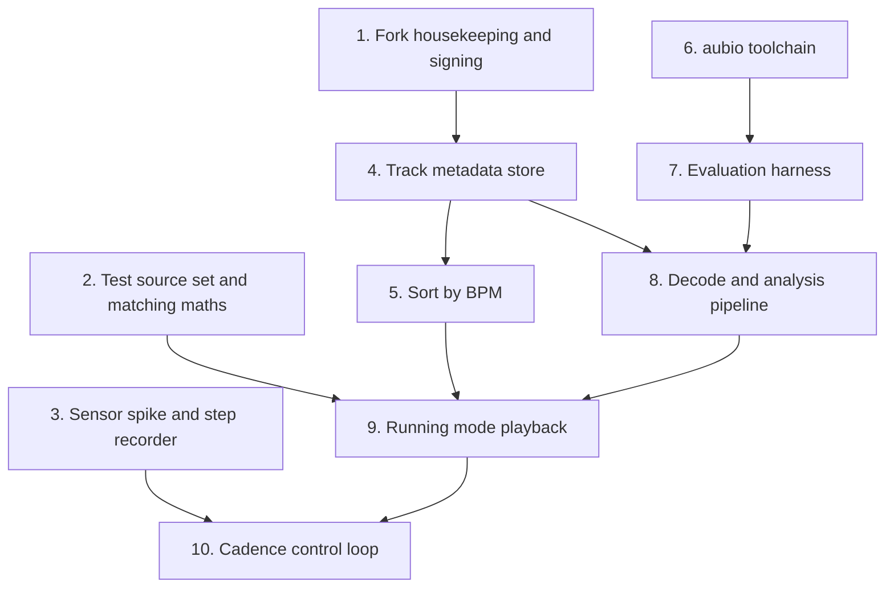

## Verdict

All five goals are feasible, and Chocola was a good pick — Room, Media3 with a real `MediaLibraryService`, Koin DI, and a taglib binding are already wired up, so you're adding features rather than building infrastructure. Roughly: goal 5 is an afternoon, goal 2 is a day, goal 1 is the bulk of the engineering, goal 4 is the riskiest, and **goal 3 needed a design decision rather than more code, because matching raw BPM to raw cadence isn't musically achievable.** That decision is now settled below — octave folding with a tolerance band — and since it's the heart of the app, it's the longest section here.

The one structural thing to know up front: this app deliberately keeps no per-track cache. `AbstractTracksScanner` re-queries MediaStore on every launch and rebuilds `List<CuteTrack>` in memory; Room holds playlists and nothing else. BPM is expensive to compute and must persist, so you're introducing the app's first real track-metadata store. That's the spine everything else hangs off.

## Goal 1: BPM analysis

You need two things the app doesn't have: access to decoded audio, and somewhere to keep the result.

**Getting audio.** The equalizer works via `DynamicsProcessing` attached to ExoPlayer's output audio session, so no PCM ever reaches Kotlin. Don't try to fix that by inserting a custom `AudioProcessor` into playback — analysing during playback means a song's BPM is only known after you've already played it, which is useless for sorting. Instead decode files offline with `MediaExtractor` + `MediaCodec`, which runs many times faster than realtime. Downmix to mono, resample to ~22 kHz, and analyse maybe 60–90 seconds from the middle of the track rather than the whole thing. A typical song lands in the low seconds.

**Computing BPM. Decided: [aubio](https://github.com/aubio/aubio).** GPLv3 C, so a perfect license fit, and the strongest accuracy of the realistic options. The cost is that it drags in an NDK toolchain the project doesn't have — there's no `externalNativeBuild` or CMake anywhere today, and the existing `abiFilters` entry is only there because taglib ships prebuilt native libraries. Build and integration details are in the build section below.

Recorded for completeness, since both stay viable if aubio disappoints:

[TarsosDSP](https://github.com/JorenSix/TarsosDSP) is pure Java, also GPLv3, with onset detection and a BeatRoot port, and it would need no native toolchain at all. The catch is that the Maven Central artifact `be.tarsos.dsp:core:2.5` dates to 2023 and omits the Android I/O classes, so you'd vendor the source. Worth keeping in mind as the fallback that costs nothing but a dependency.

Essentia is the most accurate of the three, but it's AGPLv3 and a heavy C++ build — the license alone complicates GPLv3 distribution. Skip.

Rolling your own — spectral flux into autocorrelation or a comb filter bank — is also genuinely viable at maybe 300 lines of Kotlin, especially given the octave-agnostic accuracy note below. Not needed now that aubio is chosen, but it's the reason not to panic if the NDK work gets ugly.

Whichever engine is in play, **put it behind an interface that takes `FloatArray` PCM and returns BPM plus a confidence value.** That keeps the swap cheap and, as the build section explains, is what makes the DSP testable off-device.

Also read the file's existing `TBPM`/`BPM` tag via taglib first and skip analysis when it's present — free and instant for tracks that already carry it. Note that if you later want to *write* BPM back to files, the current save path in `Extensions.kt` rebuilds a fixed property map from a whitelist, so it silently drops unknown tags. Writing BPM means merging into the existing `propertyMap` instead — which is arguably an upstream bug fix worth contributing back.

**The key design decision: what to key the cache on.** Your instinct will be `mediaId`, but that's `MediaStore._ID`, which is not stable — it changes when the media store is rebuilt or files move, and SAF tracks use `uri.hashCode()`. The existence of `PlaylistCleanup.kt`, which purges stale mediaIds from playlists, is proof this happens in the wild. Losing an entire library's analysis to a rescan would be brutal.

`PlaylistCleanup` is worse than it first looks, and it's worth reading before you design the key. It queries MediaStore for every `_ID`, then deletes any playlist entry not in that set — but SAF tracks are keyed by `uri.hashCode()` and are *never* in a MediaStore result. So every SAF track silently disappears from every playlist on the next cleanup pass. That's an upstream bug you'll want to fix rather than replicate, and it's a concrete demonstration of why one opaque id space shared by two very different sources is the wrong foundation to build BPM storage on. Key on something durable instead: path plus file size plus duration, or a hash of the first chunk of file bytes. Get this right on day one; migrating it later means re-analysing everyone's library.

**Running it at scale.** For a 2000-track library you need a proper background job with progress UI, cancellation, and charging/idle awareness. WorkManager isn't a dependency yet, so that's one addition. Room is at version 2 with an existing `MIGRATION_1_2` you can copy the pattern from.

## Goal 2: sort by BPM

Easy, with two small traps.

Library sorting currently happens in SQL — `tracksSettingsToMediaStore()` builds an `ORDER BY` clause for the `ContentResolver.query()`. BPM lives in your database, not MediaStore, so BPM sort has to be an in-memory pass after the query. Fine, and the album/artist/playlist screens already sort in memory via `ordered()` extensions, so there's precedent.

The trap is that `TrackSort` is persisted as an **integer index** into `enum.entries`. Append `BPM` at the end; inserting it mid-enum silently rewrites every existing user's saved sort preference. Related: `AS_ADDED` already sits at index 5 but `TrackSortPopupContent()` only renders `repeat(5)` options, so there's a latent off-by-one in that popup you'll be editing. It's not only a UI gap — `tracksSettingsToMediaStore()` maps `AS_ADDED` to an empty column name and then concatenates, producing the ORDER BY string `" COLLATE NOCASE ASC"`. Anyone who reaches that state gets meaningless ordering. Since you're appending a seventh entry to this exact enum and adding a second, in-memory sort path beside the SQL one, fixing `AS_ADDED` costs almost nothing while you're there. Decide too where un-analysed tracks sort — nulls last is the sane default.

## Goal 3: speed matched to a target BPM

The code is nearly trivial and the product design is genuinely hard.

The easy half: Media3's `PlaybackParameters.speed` already time-stretches while *preserving pitch* (it uses Sonic internally), and `pitch` is a fully separate parameter the app exposes independently. So tempo-only adjustment is free — you literally already have `PlayerActions.SetSpeed`. You'd want the existing "snap" toggle, which ties pitch to speed, forced off in running mode. And `MusicViewModel.onMediaItemTransition` already resolves the `CuteTrack` for each new item, so the recompute hook is a few lines in an existing block.

Now the hard half. Running cadence is roughly 150–190 steps per minute. Most music sits at 90–140 BPM. Forcing a 95 BPM track to 170 BPM literally requires 1.79× speed, which sounds mangled even with pitch preserved. **Matching raw BPM to raw cadence doesn't survive contact with a real music library.**

### Octave folding, and why it fixes the original objection

Runners don't step once per beat — they step on beats or *between* beats. An 85 BPM track at two steps per beat already *is* 170 SPM with no stretch at all. So the quantity to match isn't the track's BPM, it's the track's BPM times some step-per-beat factor. Work in log space: fold each track's BPM by powers of two until it lands nearest the target cadence, and the residual is the stretch you actually have to apply.

```
k        = round(log2(target / bpm))     // steps per beat, as a power of two
folded   = bpm * 2^k
speed    = target / folded               // the stretch you must apply
```

Because `k` is rounded, the residual is bounded: `speed` always falls in `[2^-0.5, 2^0.5]`, i.e. **±41% worst case, and that bound is unconditional.** That's the number you identified, and it's the key structural fact. A track sitting exactly halfway between two octaves is equidistant from both, and 41% is genuinely too much to listen to — so folding alone isn't sufficient, which is where your tolerance band comes in.

Now the part that reconciles this with your original instinct against filtering. Accept a track only when its residual is within a ratio `r`, and the accepted set is not one narrow BPM window — it's a window repeated at *every* octave:

```
accept if  bpm ∈ ⋃  [ target·2^k / r , target·2^k · r ]
                  k
```

For a 100 SPM target at `r = 1.2` that's 83–120 **and** 167–240 **and** 42–60, exactly as you described. That union is why this isn't the naive filtering you objected to. Naive filtering means "only songs at 100 BPM ± a bit," which throws away almost everything; octave-folded banding keeps a slice of every tempo region in the library. Your original objection was really to *single-band* filtering, and this is a different animal.

The two ideas also turn out to be the same formula. Adjacent bands touch when `r² = 2`, so at `r = √2 ≈ 1.414` the bands tile the whole number line and the filter accepts everything — which is precisely the "fold and accept any residual" case. **`r` is a single dial from "accept everything, up to ±41% stretch" down to "accept little, near-zero stretch."** That's a clean design, and I'd build exactly this.

As a back-of-envelope for what `r` costs you: if track BPMs were spread uniformly in log space, the fraction of the library accepted is just `2·log₂(r)`.

| `r` | max stretch | rough share of library kept |
| --- | --- | --- |
| 1.05 | ±5% | ~14% |
| 1.10 | ±10% | ~28% |
| 1.20 | ±20% | ~53% |
| 1.414 | ±41% | 100% |

Treat those as an upper bound, not a prediction — real BPM distributions are lumpy, which is the next problem.

### In practice it's a binary choice, not an infinite grid

Worth noticing before you write the code: for real running cadences, only two values of `k` are usable. Reachable bands for a 150–190 SPM target are 150–190 BPM at one step per beat (`k = 0`), and 75–95 BPM at two (`k = 1`). The next step up, four steps per beat, would need 37–48 BPM tracks — which barely exist, and a beat that sparse is impossible to entrain to anyway. Going the other way, one step per two beats, would need 300–380 BPM tracks, which don't exist. So the whole octave-folding machinery collapses to: **compute the speed for one step per beat and for two, take whichever is closer to 1.0.** Clamp `k` to `{0, 1}` explicitly rather than trusting `round()`, or a mis-detected 40 BPM ambient track will happily report a perfect match at four steps per beat.

### The 120–130 BPM trap

This is the thing your 100 SPM example hides, and it's the most important practical consequence. The single largest tempo cluster in pop and EDM is 120–130 BPM. Check whether it's reachable from a running cadence: 125 doubles to 250 and halves to 62.5, and no power-of-two multiple of 125 lands anywhere in 150–190. A 170 SPM runner is at `120 × √2`, meaning the biggest cluster in the library sits at the *exact worst case* of the fold — 41% off, in both directions.

So library coverage is a lumpy function of the target cadence, not a smooth one. Cadences whose half-value lands on a real tempo peak do well (160 → 80, 180 → 90, 190 → 95); cadences that land in a trough do badly (170 → 85, between the 80 and 90 clusters). This suggests a feature rather than a compromise: compute the folded-BPM histogram of the user's own library, and let the app **suggest a target cadence** within a few SPM of their measured one that their library actually supports. Human cadence has a comfortable range of several SPM anyway, and nudging it slightly upward is generally considered good running form, so this is a defensible nudge rather than a hack. Shifting a target from 170 to 178 can unlock a large chunk of library at a much tighter `r`.

The gap at `√2` can only be filled by non-power-of-two factors. Three steps per two beats would put a 120 BPM track at 180 SPM with essentially zero stretch — mathematically perfect, but it's a 3:2 polyrhythm against a straight 4/4 groove and most people find it fights the music. It *is* natural in 6/8 and shuffled material. Ship it as an experimental opt-in at most; don't put it in the default factor set.

### Set the tolerance from run length, not the other way round

Your observation that a bigger library allows a tighter range generalises nicely, and inverting it makes for better UX. Rather than having the user pick `r` and discover how many tracks survive, have them state how long they're running. Rank every analysed track by absolute log-deviation, take tracks until the duration is filled, and `r` falls out as the worst deviation you had to include. That's self-tuning, guarantees the run is covered, and minimises average distortion instead of just bounding it. It also gives you an honest thing to display: "45 minutes, 68 tracks, at most ±7% stretch."

One prerequisite that isn't obvious until you try to write it: **`CuteTrack` has no duration field.** The scanner projects only `_ID`, `TITLE`, `ARTIST`, `ALBUM`, `DATA` and `TRACK`; duration appears solely in the `WHERE` clause as a minimum-length filter, and `MusicState.duration` comes from the player and so only exists for the track currently loaded. Filling a run of known length requires per-track duration for the whole library, so `MediaStore.Audio.Media.DURATION` has to join the projection and the model. Cheap, but it belongs in the persistence work rather than being discovered halfway through the queue builder — and note that the duration you need for planning is the *stretched* duration, `duration / speed`, which is the same correction `CuteSlider` already applies.

Two caveats. Keep a hard musical ceiling on `r` (somewhere around 1.15) so a thin library degrades by admitting a shorter queue rather than by producing unlistenable audio. And don't order the queue strictly by deviation, or every run starts with the same songs — filter by deviation, then shuffle within, optionally weighted toward smaller deviation.

One more knob worth testing: the band probably shouldn't be symmetric. Speeding up adds energy that suits running, while slowing down tends to drag, so something like +12%/−8% may feel better than ±10%. That's a hypothesis to validate on real runs, not a fact.

### This makes Goal 1 easier

A useful consequence: because the whole scheme folds by powers of two, the classic failure mode of tempo detectors becomes harmless. Reporting 85 when the truth is 170 — the octave error that the MIR field tracks separately as "Accuracy2" versus "Accuracy1" — produces an identical playback speed here. You only need octave-agnostic accuracy, which is much easier to hit and is a solid argument for the roll-your-own detector suggested above.

### Implementation gotchas

**Speed logic must live in the service, not the ViewModel.** `MusicViewModel` is UI-layer. On an actual run the screen is off and the activity is very likely destroyed while `PlaybackService` keeps playing — at which point track transitions stop triggering your recompute and the speed freezes at whatever the last foreground track needed. `PlaybackService.listener` doesn't implement `onMediaItemTransition` today. Moving the BPM/speed logic into the service or a Koin-injected domain object is a slightly larger refactor than the ViewModel hook suggests, and it's the same conclusion you'll reach for the step counter.

**Persistence needs rethinking.** Speed currently lives in `MusicState.speed` and is written to DataStore in `onCleared()`. Once speed is derived per track, that stored value is meaningless on restore. What you want to persist is the *target cadence* and the tolerance, plus a mode flag distinguishing manual speed from cadence-locked. Also ramp speed changes rather than stepping them, to avoid clicks at track boundaries.

**Never change the step-per-beat factor mid-track.** Once the step counter is drifting the target (Goal 4), the optimal `k` for the current track can flip while it's playing — and applying that means a 2× speed jump mid-song. Re-evaluate `k` only at track transitions; mid-track, allow only the residual stretch to move, clamped and ramped.

**The queue has to be built lazily.** A drifting target means the accepted set of tracks changes during the run, so materialising a fixed playlist up front is wrong. Today `PlayerActions.StartPlaylist` does `setMediaItems(targetTracks.fastMap { it.toMediaItem() }, 0, 0)` — the entire list, once. For running mode you want a short lookahead window that gets revised as the target moves, via `replaceMediaItems` / `addMediaItems`. That's a genuinely different queue architecture from what exists, and it's easier to design for now than to retrofit.

**A cosmetic setting becomes load-bearing.** `CuteSlider.kt` already divides displayed time by `musicState.speed` when the `DYNAMIC_DURATION` preference is on. Since every track in running mode plays at a non-unity speed, that existing feature turns into the correct default rather than a curiosity — and the same correction has to reach anywhere you show a track or playlist duration, including the run-length estimate above.

## Goal 4: step counter driving the target

Technically medium, but this carries the most risk — both platform and UX.

Use `Sensor.TYPE_STEP_DETECTOR` (one event per step, low latency, hardware-batched on most devices) rather than `TYPE_STEP_COUNTER` (cumulative and laggy) and derive cadence from inter-event intervals. Avoid raw accelerometer polling; it's a battery sink. `ACTIVITY_RECOGNITION` is a runtime permission from API 29, and your `minSdk` is 28, so you need both paths. The manifest currently declares no sensor permissions and there is zero sensor code in the repo.

The platform uncertainty worth verifying early on a real device: the service is `foregroundServiceType="mediaPlayback"`, and background sensor access under newer Android versions has restrictions. You may need to add the `health` FGS type with its accompanying permissions. Test this on a modern device before building much on top of it.

The UX risk is bigger and it's a control-theory problem. **Naive feedback runs away**: you speed up the music, the runner speeds up to match, cadence rises, you speed up again. You need aggressive smoothing (a 30–60 second median, not an instantaneous reading), a deadband so small fluctuations do nothing, and rate limiting on how fast the target can move. Honestly, the best default may be a "measure then lock" mode — sample the runner's natural cadence for the first minute, set the target, and hold it, with continuous tracking as an opt-in. You also need to detect stopping and walking so you hold the last target instead of collapsing to 0.6× at a traffic light.

## Goal 5: license and fork housekeeping

Cheap, and worth doing before you write a line of feature code.

GPLv3 obligations on a fork: keep the license, retain sosauce's copyright notice (add yours alongside, don't replace), and state that you modified the files — that's §5(a). The bundled font is separately OFL-1.1, so keep `font_licence.txt` intact.

Your library candidates are all fine: TarsosDSP and aubio are GPLv3, a perfect match. SoundTouch is LGPLv2.1 and compatible, though you don't need it since Media3 already time-stretches. Essentia's AGPLv3 is the only one that changes your license story.

The practical fork chores nobody remembers:

`applicationId` is still `com.sosauce.cutemusic` while the namespace is `com.sosauce.chocola`. You **must** change the applicationId or your app can never be installed alongside Chocola or distributed independently. The release APK is also named `Chocola_${versionName}.apk` in `app/build.gradle.kts`. Separately, GPLv3 licenses the code, not the branding — the "Chocola" name and the mascot artwork aren't yours to ship, so plan a rebrand of name and assets. `GET_STARTED.md` still tells contributors to clone `sosauce/CuteMusic`, and there's a `release_key.jks` signing path plus GitHub Actions secrets pointing at the upstream author's setup.

One more thing that will matter for years: you'll want to keep pulling upstream improvements. Your changes as scoped would touch `CuteTrack`, `AbstractTracksScanner`, `Enums.kt`, `CuteSearchbar.kt`, `MusicViewModel`, and `PlaybackService` — all high-churn upstream files. Keeping new logic in its own package and minimising edits to existing files will make those rebases dramatically less painful. Also note the toolchain is bleeding-edge (compileSdk 37, AGP 9.3.2, Material3 alpha, Navigation3), so expect churn independent of your work.

## Build and test setup

Short version: the plan is feasible, and **the move to Kubuntu deleted most of what this section used to be about.** Roughly half the build goal was already done upstream, and the other half — a Linux toolchain that can cross-compile C for Android — is now simply the machine you're sitting at. Build on the host, let GitHub Actions produce APKs, and don't build the Docker image.

### What already exists

`.github/workflows/nightly_build.yml` is a working Ubuntu + JDK 17 job that runs `./gradlew assembleDebug` and publishes the APK to a prerelease GitHub release. That is precisely "an automated build producing a test-signed APK," already written and already working. `release_stable.yml` handles the release-signed path too, decoding a base64 keystore from `secrets.SIGNING_KEY` into `app/release_key.jks` and feeding the three signing env vars that `app/build.gradle.kts` already reads. Both are `workflow_dispatch`, so nothing fires until you ask it to.

The fork plumbing is done as well: `origin` is `alpha-liu-01/RunningMusic`, `upstream` is `sosauce/Chocola`, and you're currently on branch `test`. Both workflows reference only repo-relative paths, so they'll run unchanged on your fork the moment you dispatch them. What's left for "automated build → APK" is cosmetic and administrative — the release APK is still named `Chocola_${versionName}.apk`, the upload artifact is still called `CuteMusic Release`, the nightly job globs `./**/*.apk` indiscriminately, and the three signing secrets are still sosauce's. Hours, not days. Building a parallel Docker pipeline to do the same thing would mean maintaining two build definitions that will drift.

Two other pleasant surprises: `.gitignore` already covers `.cxx/` and `.externalNativeBuild/`, so someone anticipated native code, and `*.jks` / `*.keystore` are already ignored, so the obvious keystore-leak footgun is pre-disarmed.

### What doesn't exist: any tests at all

`testInstrumentationRunner` is declared in `defaultConfig`, but there is **no `app/src/test/`, no `app/src/androidTest/`, and not a single test dependency** in `app/build.gradle.kts`. No JUnit, no androidx.test, no Espresso. You are starting testing from zero, which is worth knowing before writing a "test setup" — there is no setup to extend.

### Docker: no longer worth building

On Windows this was the load-bearing recommendation, because a container was the only convenient way to get a Linux toolchain at all. On Kubuntu that argument evaporates. The image was doing three jobs — providing Linux, isolating the NDK, and hosting a native aubio build for evaluation — and the host now does all three.

The Gradle build was never the case for Docker anyway: GitHub Actions gives you a clean Ubuntu image per run, which is stronger reproducibility than a local container, for free.

The NDK isn't a case for it either, once you look at what it actually is. `ndk;29.x` is a self-contained Clang toolchain shipping its own sysroots; it doesn't link against the host's libc or pick up host headers. Installing it through `sdkmanager` on the host produces the same cross-compilation as installing it in an image. The "rots between machines" failure mode is really "rots between NDK versions," and you fix that by pinning `ndkVersion` in `app/build.gradle.kts`, not by maintaining an 8 GB image.

And the Linux host build of aubio — the thing that makes the BPM evaluation harness fast — is now just `gcc` on this machine, with CMake 4.2.3 and ffmpeg 8.0.1 already installed.

Two cases would still justify an image later, neither urgent: reproducing a CI failure you can't reproduce locally, and pinning the evaluation harness so an accuracy figure from six months ago stays comparable. Docker 29.4.1 is installed and your user is in the `docker` group, so that option costs nothing to keep open — it just isn't the right default any more. The shape to aim for now is the host owning day-to-day builds and the native toolchain, and GitHub Actions owning APK production.

### The host: three things to fix before the first build

The filesystem problem is gone. The checkout lives at `/home/alpha/Documents/GitHub/RunningMusic` on ext4 with no translation layer in the way, and there's no second operating system to accidentally build the same tree from. The machine is a Ryzen 9 7945HX with 32 threads, 62 GB of RAM and 290 GB free — comfortably more than this build needs, which matters for one setting below.

Three concrete problems, all cheap, all worth clearing before anything else:

**`~/.gradle` is owned by root.** It's `drwxr-xr-x root root` and dated April, so at some point Gradle ran under `sudo` on this install. The wrapper doesn't degrade gracefully — `./gradlew --version` fails outright today with `Could not create parent directory for lock file`. A single `sudo chown -R alpha:alpha ~/.gradle` fixes it. Worth understanding rather than just fixing, because it's precisely the root-owned-artifacts failure the old container advice was warning about, arrived at without any container.

**There is no JDK 17.** The system has OpenJDK 21 and 25, and `java` resolves to 25. Both workflows use Temurin 17, and the project compiles to JVM 17 bytecode. Gradle 9.7 with AGP 9.3.2 on a JDK 25 daemon is not a combination this project has ever been built with, and when a JDK is too new for AGP the symptom is an obscure Kotlin-daemon or bytecode error rather than a clear message. `openjdk-17-jdk` is in the archive: install it and pin it via `org.gradle.java.home` in your *user-level* `~/.gradle/gradle.properties` — not the repo's, so you don't commit a machine-specific path — and local builds will then agree with CI.

**There is no Android SDK.** `ANDROID_HOME` is unset, `~/Android/Sdk` doesn't exist, and there's no `local.properties`. The Debian `/usr/lib/android-sdk` is platform-tools only, at 34.0.5, and will not build anything. You need `cmdline-tools` and an `sdkmanager` install — the one part of the old Dockerfile that survives, now as a shell script.

One tuning note while you're in there: `gradle.properties` sets `org.gradle.jvmargs=-Xmx1536M` with a matching 1536 MB Kotlin daemon. That's an upstream default sized for modest machines, and it's about four percent of your RAM. Raise both, and consider `org.gradle.parallel` and `org.gradle.caching`. Note that `org.gradle.configuration-cache=true` is already enabled, which is good but is also the thing most likely to complain once you add `externalNativeBuild` and a test source set — if a configuration-cache error appears right after those changes, suspect the new code rather than the machine.

### adb: it just works now

The USB passthrough problem doesn't exist on a native Linux host. `android-udev-rules` is installed, your user is in `plugdev`, and `~/.android/adbkey` already exists from an earlier session, so an authorised device should appear on plug-in with no further setup. Nothing is attached at the moment, so confirm it rather than assume it.

The one real wrinkle is version skew. The `adb` on your `PATH` is Debian's 34.0.5 from 2023, and `sdkmanager` will install Google's current `platform-tools` alongside it. Two adb binaries at different versions will repeatedly kill each other's servers, which is a genuinely baffling five minutes the first time. Put the SDK's `platform-tools` first on `PATH` and either remove the Debian package or ignore it consistently — but decide once.

Wireless debugging still matters, and for goal 4 it stops being a convenience and becomes necessary: **you cannot be tethered by USB while running.** `adb pair` then `adb connect` over the LAN, plus `logcat`, is how you'll actually observe a cadence control loop in the field. If `adb mdns check` reports discovery unavailable — Debian's adb build sometimes omits it — pair using the explicit `host:port` the phone displays instead of relying on autodiscovery.

### One dev keystore, or you will lose an afternoon

Debug builds are signed with `~/.android/debug.keystore`, which is generated per-machine at random. The moment CI builds a debug APK — or you rebuild this laptop, or add a second one — the signatures differ and `adb install` fails with `INSTALL_FAILED_UPDATE_INCOMPATIBLE`, so you uninstall and lose app data every time you switch build source. Generate **one** dedicated dev keystore, keep it outside the repo (it's gitignored anyway), and wire it into an explicit `debug` signingConfig. Do this on day one; conveniently, `~/.android` holds no `debug.keystore` at all right now, since nothing has ever built on this machine, so you're setting the policy on a clean slate rather than migrating off an accidental one. The existing `applicationIdSuffix = ".debug"` already lets debug and release coexist on the device, which is good, and worth preserving.

### Three toolchain facts, now checked rather than assumed

The SDK question is settled: Google's stable channel currently publishes `platforms;android-37.0`, `37.1` and `37.2`, along with `build-tools;37.0.0`. No preview channel needed, and nothing here blocks. One detail that will bite when you write the install script, though — since Android 16 the platforms are minor-versioned, so **there is no bare `platforms;android-37` package**; `compileSdk = 37` wants `platforms;android-37.0`.

**Android 15+ requires native libraries to support 16 KB memory page sizes.** You're about to add native code for the first time, so this applies to you, and it's easy to miss until a store rejection or a crash on a 16 KB device. Use NDK r28 or newer, where it's the default — stable currently offers 28.2.x, 29.0.x and 30.0.x. Pin an exact `ndkVersion` rather than letting AGP choose, and verify alignment on the built `.so` files rather than assuming.

Third, and new now that you're building on a host with its own toolchain: **pin the CMake version too.** The host has CMake 4.2.3 on `PATH`, and CMake 4 dropped compatibility with `cmake_minimum_required(VERSION < 3.5)`. Set `externalNativeBuild.cmake.version` to an SDK-provided CMake so Gradle uses that rather than whatever the host happens to have — this is also what keeps your native build and CI's native build the same build.

### Aubio specifics

Don't try to cross-compile aubio with its own build system. aubio uses `waf`, and making waf target the Android NDK is a fight. aubio's sources are clean C99 with essentially no mandatory dependencies, so the tractable route is to **write your own `CMakeLists.txt` over aubio's `src/`** and hook it up through Gradle's `externalNativeBuild { cmake { } }`, which is the supported, documented path. Build with aubio's bundled ooura FFT (`HAVE_FFTW3` off) so you pull in no external library at all.

Write that `CMakeLists.txt` so it configures for the host as well as for the NDK. It's the same C either way, and one source list configured twice — once with the NDK toolchain file for `arm64-v8a` and `armeabi-v7a`, once with plain `gcc` — hands you the evaluation binary described below for free, and guarantees the code you measure accuracy on is the code you ship. On Windows that dual build was the container's entire justification; here it's a second build directory.

Pin a specific git commit rather than the released tarball: aubio's last release is 0.4.9 from 2019, but master is still maintained. Vendoring a pinned commit in-tree also cleanly satisfies your GPLv3 corresponding-source obligation.

Keep the JNI surface tiny — a handle-based object holding an `aubio_tempo_t*`, one function that feeds a hop of mono float PCM, and getters for BPM and confidence. For a whole-file estimate, collect beat times and take the median inter-beat interval rather than trusting the running `aubio_tempo_get_bpm` value; that's the standard approach in the tempo-estimation literature.

Do use `aubio_tempo_get_confidence`. It matters more here than in most applications: a wrong BPM doesn't produce a slightly-off playlist, it produces a track played at a wildly wrong speed. Low confidence should mark a track "BPM unknown" and exclude it, not guess.

### Testing: the part your plan doesn't cover yet

You described building thoroughly and testing only as "I have a phone and adb." The phone is necessary but it's the *least* automatable layer, and the highest-value testing here is nowhere near it.

**BPM accuracy is an evaluation harness, not a unit test.** There's no assertion that passes or fails; there's an accuracy figure that you want to not regress. Build it as a native binary on the host over a corpus with known tempos, and — per the Goal 3 analysis — score it **octave-agnostically**, folding the log-ratio between estimate and truth into `[0, 0.5]`. That's the only metric that reflects what your app actually needs, and it's much more forgiving than the strict accuracy figures aubio is usually judged by. Also plot correctness against aubio's confidence, so you can pick the threshold below which you refuse to guess. Don't commit audio to the repo; commit a manifest of file hashes and ground-truth BPMs pointing at a local corpus. ffmpeg is already installed, so decoding that corpus to raw mono PCM is one command per file and the harness never needs `MediaCodec` — the same `FloatArray` boundary argument made two paragraphs down, arriving from the other direction. Hand-tapping fifty tracks from your own library is a perfectly respectable start, and synthetic click tracks give you exact-truth regression fixtures for free.

**The pure Kotlin logic is where cheap tests pay off most.** Octave folding, tolerance banding, queue selection, and duration estimation from Goal 3 are all pure functions with no Android dependency. They're also exactly the code where an off-by-one silently produces music at 1.4× instead of 1.05×. A plain `src/test/` source set with JUnit covers all of it in milliseconds, and it doesn't exist yet.

**Design the cadence loop to be testable or you'll be debugging it by going jogging.** This is the single most important testing decision in the project. Make the control loop a pure function over a stream of step timestamps, then add a debug mode that records raw step timestamps to a file. One real run then gives you a replayable fixture forever, and you can unit-test the failure modes that matter — runaway feedback, stopping at a traffic light, walking breaks, a dropped sensor — without leaving your chair. Retrofitting this later is painful; the natural instinct is to wire sensor callbacks straight into playback, and that produces a system you can only test by exercising.

**Reserve the device for what only a device can do.** `MediaExtractor` and `MediaCodec` are real Android APIs that Robolectric won't meaningfully fake, so keep the decode layer thin and cover it with instrumented tests. Room migrations deserve `room-testing`'s `MigrationTestHelper`, given you're adding a migration and the stable-key decision from Goal 1 is hard to undo. Playback feel, audio artefacts at various stretch ratios, and battery drain are manual. Don't invest in Espresso.

If you draw the boundary between decode and DSP at `FloatArray` PCM, the DSP becomes host-testable and the decoder becomes independently instrumentable. That's a good reason to define it that way even ignoring tests.

### Where your single test device falls short

Real hardware is essential for goals 3 and 4 — an emulator has no meaningful step counter and tells you nothing about battery. But three gaps are worth naming now:

crDroid is a custom ROM, so verify early that `TYPE_STEP_DETECTOR` exists and is hardware-backed (`adb shell dumpsys sensorservice`). A software-backed step detector behaves differently on latency and battery, and you'd be tuning against the wrong baseline.

Custom ROMs are also permissive about background execution. "Works on crDroid" says very little about Samsung or Xiaomi, where aggressive process killing is the norm. The foreground-service and background-sensor questions flagged in Goal 4 eventually need a stock OEM device — this is a real blind spot, not a theoretical one.

And your device is Android 16 (API 36) while the app targets API 37, so the behaviour changes you opt into by targeting 37 are exactly the ones you can't observe. `minSdk = 28` is likewise never exercised. Two emulator images, one at API 28 and one at API 37, close both gaps, and on this machine they're genuinely cheap: `/dev/kvm` exists, the CPU reports AMD-V, and an ACL already grants your user read-write access, so hardware acceleration works without even adding yourself to the `kvm` group. Budget a little patience for the emulator's graphics path instead — KDE on Wayland with an NVIDIA card is the configuration most likely to need a `-gpu` fallback.

### Practical host setup notes, for when we do it

Install `cmdline-tools` into `~/Android/Sdk`, accept the licenses, then `sdkmanager` the rest: `platform-tools`, `platforms;android-37.0`, `build-tools;37.0.0`, an `ndk;29.x`, and a `cmake`. Write it as a checked-in shell script rather than commands you run once — see the GPL note below, and because CI will eventually want the identical list.

Expect roughly 8 GB on disk once the NDK is in; with 290 GB free, the constraint that mattered on Windows doesn't apply, and neither does the `.wslconfig` memory cap that used to get the Kotlin daemon OOM-killed. `local.properties` is gitignored and will be generated with the SDK path, which is correct and should stay uncommitted.

The one piece of container advice that carries over, inverted: keeping the Gradle and Kotlin daemons warm was the reason to prefer a long-lived container over one-shot `docker run`. On the host you get that for free — just don't habitually pass `--no-daemon`, and never run Gradle under `sudo`, which is how `~/.gradle` came to be root-owned in the first place.

### A GPL note

GPLv3's "Corresponding Source" includes the scripts used to control compilation and installation. A documented, scripted, reproducible build isn't just good practice for this project — it's part of what you're obliged to distribute. Worth keeping the build definition in-repo and readable rather than leaving it as tribal knowledge in one laptop's shell history. It's also the tidiest argument for writing that SDK bootstrap as a checked-in script.

## Suggested order

Step zero, before any of the features, is shorter than it was. Fix the root-owned `~/.gradle`, install JDK 17 and pin it, install the SDK, and get `./gradlew assembleDebug` to succeed once on this machine — that single green build retires most of the uncertainty in the section above. Then create the dev keystore and do the artifact renames in the two workflows. The `platforms;android-37` question is already answered and the fork remotes are already configured, so both drop off the list entirely.

Then I'd sequence it to de-risk early: the fork housekeeping and rebrand; then the persistence layer with the stable-key decision and a manually-entered BPM field, which lets you build and validate goal 2's sorting end-to-end with zero DSP; then the aubio toolchain and analyser behind that same interface; then the folding-and-tolerance matcher with a manual cadence slider and a fixed queue; and only last the step counter, which is what forces the dynamic queue and the control loop. That way each stage is independently useful, and the step counter — the piece most likely to fight the platform — lands on top of something already working rather than blocking it.

Two things to slot in earlier than instinct suggests, because retrofitting them is disproportionately painful: the JVM test source set (it doesn't exist, and the folding maths is the highest-value thing to test in the whole project), and the step-timestamp recorder, so that your first real run outdoors becomes a permanent test fixture.

The folding maths is cheap to write and worth prototyping off-device first: run it over a CSV of BPMs to see what tolerance your actual library supports at your actual cadence before committing to any UI. The remaining decision that's expensive to change later is the stable cache key from Goal 1.

## The remaining work, as ten plans

Step zero is done, so what follows is everything else, split into units that each survive a single planning session and land as one or two reviewable commits. The split is chosen so that every plan leaves the app in a working state and most leave it more useful than before — no plan is a six-hour stretch of broken build waiting for the next one to redeem it.

Each block below is meant to be pasted into a new plan as-is. They deliberately don't restate the reasoning; they point back at the sections above, because a plan that re-derives the argument from scratch tends to re-derive it slightly differently.



The first three have no dependencies on each other and can go in any order, or in parallel if you ever want to run plans concurrently. Plan 6 likewise doesn't depend on anything but step zero, so it's the natural thing to pick up whenever the Android-side work is blocked on a decision.

### 1. Fork housekeeping, rebrand and release signing

Goal 5 in full, plus the release signing that step zero deliberately deferred. All chores, no feature risk, and doing it first means every artifact from here on is named correctly at birth rather than renamed later. The one thing to think about rather than type is how much of the `com.sosauce.chocola` namespace to disturb.

```text
Read docs/private/Overview.md, section "Goal 5: license and fork housekeeping".

Rebrand this fork from Chocola to RunningMusic and finish the release signing
setup.

- Change applicationId from com.sosauce.cutemusic to a new id you propose. It
  must differ from upstream's so both apps can be installed side by side and
  so this fork can be distributed independently. Keep the .debug suffix.
- Decide whether to also rename the com.sosauce.chocola namespace and package
  directories. Argue the tradeoff against future upstream rebases explicitly
  before doing it, and tell me your recommendation rather than assuming.
- Replace the app name strings, launcher icon, mascot artwork and
  rootProject.name. GPLv3 licenses the code, not the branding, so the Chocola
  name and artwork are not ours to ship. The code and LICENSE stay.
- Add the GPLv3 section 5(a) modification notices and my copyright alongside
  sosauce's. Do not remove theirs. Leave font_licence.txt untouched.
- Update GET_STARTED.md and README.md, which still point contributors at
  sosauce/CuteMusic.
- Generate a release keystore, document the four GitHub secrets that
  release_stable.yml expects (SIGNING_KEY, KEY_ALIAS, KEY_PASSWORD,
  KEYSTORE_PASSWORD), and make a local assembleRelease without a keystore fail
  with a clear explanation instead of "Keystore file not set for signing
  config release".

Do not touch playback, data or UI logic.
```

My own inclination on the namespace question: change `applicationId` and the branding, leave the `com.sosauce.chocola` package alone. A package rename touches all 135 source files and turns every future upstream merge into a wall of conflicts, in exchange for cosmetics nobody but you will ever see.

### 2. The JVM test source set and the cadence-matching maths

The highest value per line in the project, and the cheapest thing to get wrong silently. This is pure Kotlin with no Android dependency, so it runs in milliseconds and needs no device. It also creates `app/src/test/`, which does not exist today.

```text
Read docs/private/Overview.md, section "Goal 3", especially "Octave folding,
and why it fixes the original objection", "In practice it's a binary choice,
not an infinite grid", and "Set the tolerance from run length".

Create the project's first JVM test source set and implement the cadence
matching maths as pure functions with no Android dependencies.

- Add app/src/test/ and the test dependencies. There are currently none at all:
  no JUnit, no androidx.test. Pick JUnit4 or JUnit5 and justify the choice.
- Implement, in a new package that upstream does not touch:
  - octave folding: given a track BPM and a target cadence, return the
    steps-per-beat exponent k clamped explicitly to {0, 1} and the residual
    playback speed
  - the acceptance band for a tolerance ratio r
  - queue selection: given (bpm, durationMs) pairs, a target cadence and a
    target run length, return the chosen tracks and the worst deviation that
    had to be admitted, subject to a hard ceiling on r
- Fill the run using stretched duration (duration / speed), not raw duration.
- Test the cases that actually bite: the 120-130 BPM cluster at a 170 SPM
  target, r = sqrt(2) accepting the entire library, a BPM exactly midway
  between two octaves, an empty library, a library too thin to fill the run,
  and confirmation that the residual never escapes [2^-0.5, 2^0.5].
- Add a small CLI entry point that reads a CSV of BPMs, so I can measure what
  tolerance my real library supports at my real cadence before any UI exists.

No Android APIs, no ViewModel, no Compose. It must all run under ./gradlew test.
```

Two things worth settling here rather than later: whether the acceptance band is symmetric (the hypothesis above is that +12%/-8% beats ±10%, but it is only a hypothesis), and whether the hard ceiling on `r` is a constant or a user setting.

### 3. Sensor spike and the step-timestamp recorder

Deliberately early and deliberately small. Goal 4 carries the most platform risk in the project, and almost all of that risk is answerable in an afternoon by a spike that touches nothing else. The recorder is here rather than in plan 10 because every outdoor run you take before it exists is a fixture you didn't capture.

```text
Read docs/private/Overview.md, "Goal 4: step counter driving the target", and
the paragraph "Design the cadence loop to be testable" in the testing section.

Build a minimal step sensor spike and a step-timestamp recorder. Explicitly do
NOT build the control loop, and do not connect anything to playback.

- Handle ACTIVITY_RECOGNITION on both paths: it is a runtime permission from
  API 29, and minSdk is 28, so the pre-29 path must work without it. The
  manifest currently declares no sensor permissions and there is no sensor code
  anywhere in the repo.
- Register Sensor.TYPE_STEP_DETECTOR, not TYPE_STEP_COUNTER. Verify on my
  device whether it is hardware-backed and report what
  `adb shell dumpsys sensorservice` says. This is crDroid, a custom ROM, so a
  software-backed detector is a real possibility and would change the latency
  and battery baseline we tune against.
- Determine empirically whether step events keep arriving while the screen is
  off and the app is backgrounded, given PlaybackService is currently
  foregroundServiceType="mediaPlayback". If the health FGS type and its
  permissions are required, add them and explain what forced it.
- Add a debug-only recorder that appends raw step timestamps to a file, and a
  documented way to pull that file off the device.
- Add a developer screen showing live step events and instantaneous cadence.

The deliverables are a recorder I can take on a real run and a written answer
to the background sensor question.
```

### 4. The track metadata store

The spine of the whole project, and the plan containing the one decision that is genuinely expensive to reverse. It ends with a manually-entered BPM field, which means the entire storage path can be exercised and validated before any DSP exists.

```text
Read docs/private/Overview.md, "Goal 1: BPM analysis", especially "The key
design decision: what to key the cache on" and the PlaylistCleanup paragraph
that follows it.

Introduce the app's first per-track metadata store.

- Add a Room entity for track metadata keyed on something durable. mediaId is
  not durable: it is MediaStore._ID for scanned tracks and uri.hashCode() for
  SAF tracks, and it changes when the media store is rebuilt or files move.
  Propose a key (path plus file size plus duration, or a hash of the first
  chunk of bytes), justify it, and keep callers working in mediaId by
  resolving mediaId -> durable key -> row internally.
- Bump PlaylistDatabase from version 2 to 3 with a MIGRATION_2_3 following the
  existing MIGRATION_1_2 pattern, register it in the Koin module in
  di/AppModule.kt (which currently exposes only the DAO, not the database),
  and add room-testing with MigrationTestHelper coverage.
- Add MediaStore.Audio.Media.DURATION to the projection in
  AbstractTracksScanner and a duration field to CuteTrack. Neither exists
  today; duration is currently only used in the WHERE clause.
- Store a nullable BPM, a confidence value, and an analysedAt timestamp.
  Nullable BPM means "never analysed", which must stay distinguishable from
  "analysed and not confident enough to use".
- Add a manual BPM entry field to the track details UI, so the store can be
  exercised end to end with no DSP at all.
- Fix PlaylistCleanup, which purges any playlist entry whose id is absent from
  MediaStore and therefore silently deletes every SAF track from every
  playlist.

No decoding, no DSP, no analysis job. Manual entry only.
```

### 5. Sort by BPM

Small, self-contained, and immediately useful once plan 4 lands, since manually entered BPMs give it something to sort. Mostly a matter of not tripping the two traps already documented.

```text
Read docs/private/Overview.md, "Goal 2: sort by BPM".

Add BPM as a track sort option.

- Append BPM to the end of the TrackSort enum in utils/Enums.kt. It is
  persisted as an integer index into enum.entries, so inserting it anywhere
  but the end silently rewrites every existing user's saved sort preference.
- BPM lives in Room, not MediaStore, so tracksSettingsToMediaStore() cannot
  express it. Add an in-memory pass after the ContentResolver query, following
  the precedent set by the ordered() extensions in utils/Extensions.kt.
- Sort un-analysed tracks last, in both ascending and descending order.
- While you are in there, fix two existing bugs in the code you are editing:
  TrackSortPopupContent() in CuteSearchbar.kt hardcodes repeat(5) against what
  will now be a seven-entry enum, and AS_ADDED maps to an empty column name so
  tracksSettingsToMediaStore() emits the ORDER BY string " COLLATE NOCASE ASC".
- Add tests for the comparator, including the nulls-last behaviour.
```

### 6. The aubio toolchain

The one plan with a real native toolchain, and the only one where a mistake shows up as a crash on someone else's phone rather than a failed build. It ends at a tested native library and does not touch the app.

```text
Read docs/private/Overview.md, "Aubio specifics" and "Three toolchain facts,
now checked rather than assumed".

Vendor aubio and wire up the NDK build. scripts/setup-android-sdk.sh has
already installed ndk;29.0.14206865 and cmake;3.31.6.

- Vendor aubio at a pinned git commit rather than the 0.4.9 tarball from 2019.
  Record the commit; vendoring in-tree also satisfies the GPLv3 corresponding
  source obligation.
- Do not try to make aubio's own waf build target the NDK. Write our own
  CMakeLists.txt over aubio's src/, using the bundled ooura FFT with
  HAVE_FFTW3 off so there are no external dependencies at all.
- Make that one CMakeLists configure for two toolchains: the NDK for
  arm64-v8a and armeabi-v7a through Gradle's externalNativeBuild, and the host
  through plain gcc for the evaluation harness in the next plan.
- Pin ndkVersion and externalNativeBuild.cmake.version explicitly. The host has
  CMake 4.2.3 on PATH and must not be the one used. Note that AGP 9's own
  default NDK is r28c (28.2.13676358); if 29 causes trouble, that is the
  version to fall back to.
- Verify the built .so files are 16 KB page aligned rather than assuming it.
  Android 15+ requires it and this is the project's first native code.
- Keep the JNI surface tiny: a handle holding an aubio_tempo_t*, one function
  that feeds a hop of mono float PCM, and getters for BPM and
  aubio_tempo_get_confidence.
- For a whole-file estimate, collect beat times and take the median
  inter-beat interval rather than trusting the running aubio_tempo_get_bpm.
- Add a host smoke test proving the library recovers the tempo of a synthetic
  click track.

Do not integrate with the app's playback or data layers.
```

### 7. The BPM evaluation harness

Not a test suite, and worth keeping mentally separate from one: there is no assertion that passes, only a number that should not get worse. It runs entirely on the host, which is why it's fast enough to be worth having.

```text
Read docs/private/Overview.md, "Testing: the part your plan doesn't cover yet",
and "This makes Goal 1 easier" in the Goal 3 section.

Build the BPM accuracy harness as a host binary on top of the host build from
the aubio plan. ffmpeg is already installed and decodes the corpus.

- Score octave-agnostically: fold log2(estimate / truth) into [0, 0.5]. Strict
  accuracy is the wrong metric for this app, because an octave error produces
  an identical playback speed once folding is applied.
- Do not commit audio to the repository. Commit a manifest of file hashes and
  ground-truth BPMs pointing at a local corpus, plus synthetic click tracks as
  exact-truth regression fixtures.
- Report correctness against aubio's confidence value, so I can pick the
  threshold below which the app should refuse to guess. This matters more here
  than in most applications: a wrong BPM does not produce a slightly-off
  playlist, it produces a track played at a wildly wrong speed.
- Make it re-runnable and its output comparable across runs.

Deliverables are the accuracy figure, the recommended confidence threshold, and
a documented way to re-run it.
```

### 8. Decode and analysis pipeline

Where the native work meets the data layer. The interface boundary specified here is the one that keeps the DSP host-testable and the engine swappable, so it's worth insisting on even where it feels like ceremony.

```text
Read docs/private/Overview.md, "Goal 1: BPM analysis" and its subsection
"Running it at scale".

Connect decoding and aubio to the metadata store.

- Decode offline with MediaExtractor and MediaCodec. Do not analyse during
  playback by inserting an AudioProcessor: a track's BPM would then only be
  known after it had already been played, which is useless for sorting.
  Downmix to mono, resample to roughly 22 kHz, and analyse 60 to 90 seconds
  from the middle of the track rather than all of it.
- Draw the boundary at FloatArray PCM: the analyser takes FloatArray and
  returns BPM plus confidence, behind an interface, so the decoder is
  independently instrumentable and the DSP stays host-testable and swappable.
- Read the file's existing TBPM/BPM tag via taglib first and skip analysis when
  it is present. Note that Extensions.kt rebuilds propertyMap from a fixed
  whitelist and so silently drops unknown tags; decide whether to write BPM
  back to files at all, and if so merge into the existing map rather than
  replacing it.
- Add WorkManager, which is not currently a dependency, for a library-wide
  analysis job with progress UI, cancellation, and charging/idle constraints. A
  2000-track library needs this to be a real background job. Do not copy the
  PlaylistCleanup pattern of an unbounded flow collector launched from
  MainActivity's lifecycleScope.
- Below the confidence threshold from the harness, record the track as BPM
  unknown and exclude it. Never guess.
- Cover the decode layer with instrumented tests; Robolectric will not
  meaningfully fake MediaCodec.
```

### 9. Running mode: cadence-matched playback

The first plan where the app does the thing it exists to do. It uses a manual cadence slider so the whole feature can be validated before any sensor is involved, which keeps the two hard problems apart.

```text
Read docs/private/Overview.md, "Goal 3: speed matched to a target BPM" in full,
paying particular attention to "Implementation gotchas".

Build running mode, driven by a manual cadence slider. No sensor input yet.

- Move the BPM-to-speed logic into PlaybackService or a Koin-injected domain
  object. It must not live in MusicViewModel: on a real run the screen is off
  and the activity is very likely destroyed while PlaybackService keeps
  playing, at which point track transitions stop triggering the recompute and
  the speed freezes. PlaybackService.listener does not implement
  onMediaItemTransition today; only MusicViewModel's listener does.
- Use the pure functions from the maths plan. Do not reimplement folding.
- Force the pitch-follows-speed "snap" toggle off in running mode. Media3
  already preserves pitch when changing speed, via Sonic.
- Replace the fixed queue. PlayerActions.StartPlaylist currently calls
  setMediaItems with the entire list at once; a drifting target needs a short
  lookahead window revised as it moves, via replaceMediaItems and
  addMediaItems.
- Persist target cadence, tolerance, and a mode flag distinguishing manual
  speed from cadence-locked. MusicState.speed becomes meaningless per track,
  and note that the whole MusicState is serialised to DataStore in onCleared().
- Ramp speed changes rather than stepping them, to avoid clicks at track
  boundaries.
- Re-evaluate the steps-per-beat exponent k only at track transitions. Mid
  track, allow only the residual to move, clamped and ramped: a mid-song k flip
  is a 2x speed jump.
- Make the DYNAMIC_DURATION correction the default in running mode, and apply
  the same division by speed everywhere a track or playlist duration is shown.
- Implement the cadence suggestion from "The 120-130 BPM trap": compute the
  folded-BPM histogram of my library and propose a target within a few SPM of
  my measured cadence that the library actually supports.
```

### 10. Closing the loop: the step counter drives the target

Last because it's the piece most likely to fight the platform, and by this point it lands on top of something that already works rather than blocking everything behind it. The control-loop-as-pure-function constraint is the single most important line in this prompt.

```text
Read docs/private/Overview.md, "Goal 4: step counter driving the target", and
the control loop paragraph in the testing section.

Drive running mode's target cadence from the step detector, reusing the
recorder and the platform answers from the sensor spike plan.

- Implement the control loop as a pure function over a stream of step
  timestamps, so recorded runs replay as fixtures. Do not wire sensor callbacks
  directly into playback; that produces a system testable only by exercising.
- Derive cadence from inter-event intervals of TYPE_STEP_DETECTOR. Do not use
  TYPE_STEP_COUNTER, which is cumulative and laggy, and do not poll the raw
  accelerometer, which is a battery sink.
- Smooth aggressively: a 30 to 60 second median rather than an instantaneous
  reading, a deadband so small fluctuations do nothing, and a rate limit on how
  fast the target may move. Naive feedback runs away, because faster music
  makes a faster runner which makes faster music.
- Detect stopping and walking and hold the last target, rather than collapsing
  to 0.6x at a traffic light.
- Default to measure-then-lock: sample natural cadence for the first minute,
  set the target, hold it. Continuous tracking is opt-in.
- Unit-test runaway feedback, traffic lights, walking breaks and a dropped
  sensor against the recorded fixtures, without leaving the chair.
- Then take it for a real run, and report what the fixtures failed to predict.
```

### What none of these plans cover

Three things are deliberately unowned, because they're judgement rather than work. Playback feel and audio artefacts across the range of stretch ratios can only be assessed by listening. Battery drain over a real hour-long run has no automated proxy. And the OEM background-execution question — whether any of this survives on a Samsung or Xiaomi, where aggressive process killing is normal — needs hardware nobody in this project owns yet. Worth revisiting after plan 10, when there is finally something whose battery cost is worth measuring.

The emulator images from the toolchain notes are also unowned on purpose. They close the `minSdk = 28` and `targetSdk = 37` coverage gaps cheaply, but no single plan needs them, so they're best added to whichever plan first breaks on an API level difference.