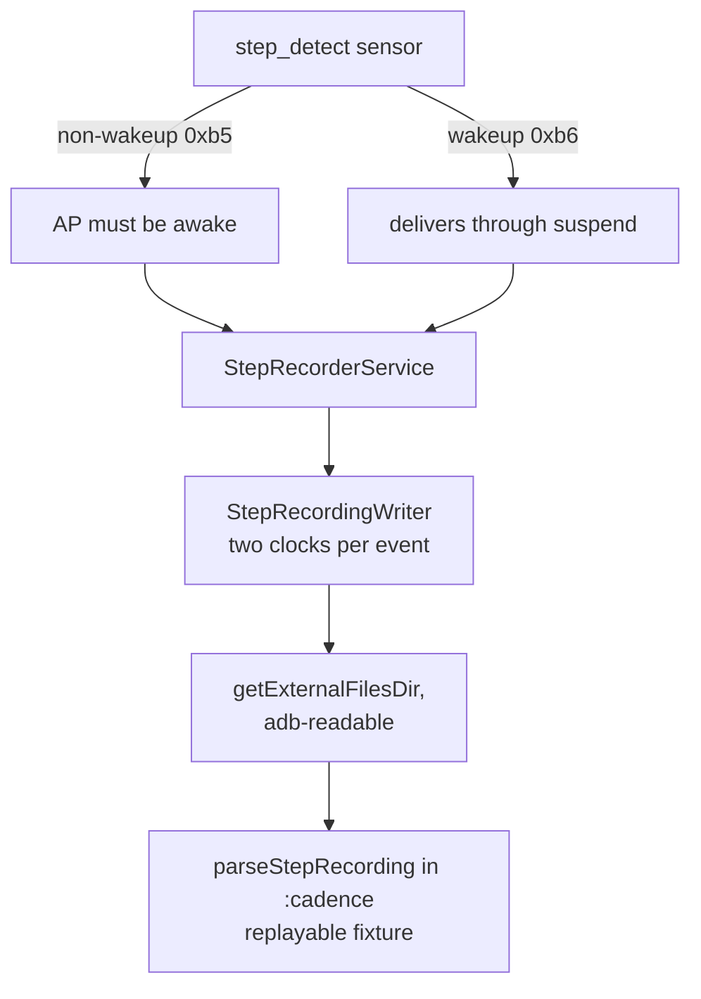

# Sensor spike: can we count steps in the background?

Plan 3 of the [Overview](Overview.md). The question the spike exists to answer is
narrow and load-bearing for everything after it: **with the app backgrounded and
the screen off, does the step detector keep delivering events to us?** If the
answer is no, the whole cadence-matching idea needs a different foundation, and
better to learn that from a five-minute walk than from a rewrite.

Everything here is one device. Findings should be re-taken on any second device
before being treated as general.

**Verdict: yes.** On the wakeup step detector, behind a `mediaPlayback`
foreground service, holding no wakelock, a five-minute untethered run at 177 spm
recovered 888 of 917 steps with the CPU suspended for 61% of the time. The `health`
foreground-service type turned out not to be needed. Detail in
[The answer](#the-answer); the reasoning and the two false starts that preceded
it are kept below because both were instructive.

## Device under test

| | |
|---|---|
| Model | Xiaomi Redmi Note 12 5G (`sunstone`) |
| Android | 16, API 36 |
| App `targetSdk` | 37 |

The `targetSdk` exceeding the device's API level has two consequences worth
keeping in mind. Behaviour changes gated on `targetSdk` 37 cannot be observed
here at all, and, more immediately, it breaks `run-as` (see below).

## What the hardware provides

`adb shell dumpsys sensorservice` reports the step detector twice:

```
0x000000b5) step_detect  Non-wakeup | qualcomm | type: android.sensor.step_detector(18)
            perm: android.permission.ACTIVITY_RECOGNITION | flags: 0x00000006
            special-trigger | FIFO (max,reserved) = (10000, 300) events | non-wakeUp
0x000000b6) step_detect  Wakeup     | qualcomm | type: android.sensor.step_detector(18)
            perm: android.permission.ACTIVITY_RECOGNITION | flags: 0x00000007
            special-trigger | FIFO (max,reserved) = (10000, 300) events | wakeUp
```

The dev screen's capability readout, which reads the same facts through
`SensorManager` rather than through a shell command, agrees exactly.

Three things follow.

**It is hardware-backed.** The vendor is `qualcomm`, so the Snapdragon Sensor
Core implements it rather than the framework synthesising steps from the
accelerometer. Latency and battery cost are therefore the real ones, not an
artefact of a fallback. (Google Play Services separately runs its own
accelerometer-based `com.google.android.location.fused.StepDetector`. That is not
what we use.)

**There is a wakeup variant, and reaching it takes deliberate effort.**
`getDefaultSensor(TYPE_STEP_DETECTOR)` returns `0xb5`, the *non-wakeup* sensor,
which cannot deliver while the application processor is suspended. Getting
`0xb6` requires the two-argument `getDefaultSensor(type, true)`. An app that
never passes the flag silently gets the variant that stops counting when the
screen goes off, and nothing in the API warns about it. This is the single most
important finding for the background question and it shapes
[StepSensors.kt](../../app/src/main/java/lol/alphaliu01/runningmusic/steps/StepSensors.kt).

**Batching is available** with a 10000-event FIFO. At ~170 spm that is roughly an
hour of buffer, so a batched registration can in principle let the processor
sleep through an entire run and hand us the events afterwards.

## What was verified over adb, without walking

The platform plumbing is confirmed end to end, over adb, without walking. Each
row is an observed `dumpsys` state, not an inference.

| Claim | Evidence |
|---|---|
| Wakeup variant is selected when asked for | `+ 0x000000b6 ... (step_detect  Wakeup, ...StepRecorder)` |
| Non-wakeup variant is selected when asked for | `+ 0x000000b5 ... (step_detect  Non-wakeup, ...StepRecorder)` |
| `mediaPlayback` FGS type is accepted | service `isForeground=true types=0x00000002` |
| `health` FGS type is accepted | service `isForeground=true types=0x00000100` |
| 60s batching is accepted by the sensor service | `batchingPeriod=60000000us result=OK` |
| No wakelock is held | `WakeLockRefCount 0` on the sensor client |
| Optional accelerometer channel works | 202 samples in ~4s at `samplingPeriod=20000us`, i.e. 50 Hz |
| Recordings round-trip | written on device, `adb pull`ed, parsed by `parseStepRecording` on the JVM |
| None of this reaches release | `aapt2 dump permissions` on the release APK lists no `ACTIVITY_RECOGNITION` |

That `health` is *accepted* is not the same as `health` being *required*. Only
the walk can answer that, and the run below is designed so that it does.

## The experiment



Four runs of about five minutes each, screen off, phone pocketed, counting paces
out loud as ground truth.

| # | Sensor | FGS type | Batching | Recorded | Median lag | Gaps | Suspend | Verdict |
|---|---|---|---|---|---|---|---|---|
| 1 | non-wakeup | mediaPlayback | none | 196 in 1.5 min, count matched exactly | 1202 ms | 4 × ~1.8 s, all in the first 16 s | not measured | Tethered, does not count |
| 2 | wakeup | mediaPlayback | none | 211 in 2 min, +2.4% vs 206 counted | 1516 ms | none | not measured | Untethered, but predates the uptime clock |
| 3 | wakeup | mediaPlayback | none | 239 in 2 min | 1452 ms | none | not measured | As above |
| 4 | wakeup | mediaPlayback | none | 888 in 5 min at 177 spm, −3.2% vs 917 counted | 1648 ms | 1 × 2.6 s, at t=3 s | **61%** (182 s of 300 s) | **Pass. This is the answer.** |
| 5 | wakeup | mediaPlayback | 60s | not run, deliberately — see below | | | | |
| 6 | whichever failed | health | as failed | not run — nothing failed, so `health` is not required | | | | |

Run 1 is the baseline, and specifically the configuration the app would have
stumbled into by writing the obvious one-argument `getDefaultSensor` call. Run 4
only happens if something before it failed; if nothing fails, `health` is not
required and we record that as the finding.

### Run 1, and why it does not yet count

Indoors, on the USB cable, screen off, ~90 seconds of pacing. Every step was
recovered; the counted total matched the recorded total exactly. On the *weakest*
of the four configurations, nothing was lost.

It does not answer the background question, because the cable almost certainly
kept the processor out of deep suspend. The recording says so itself: deliveries
arrive in bursts spaced 1006, 1005, 1006, 1010 ms apart for the entire run. A
suspended device does not wake on a tidy one-second cadence — it wakes rarely and
hands over a large batch at once. `dumpsys battery` confirms `USB powered: true`.

The four ~1.8 s gaps are about four strides each and all fall in the first 16
seconds, after which there are none. Given the exact count match they are pauses,
almost certainly turns at a wall in a small room, not lost events. On an
untethered run a genuine loss would announce itself as a count mismatch.

### Runs 2 and 3, untethered on the wakeup sensor

Both two minutes, unplugged, adb over WiFi, screen off, phone pocketed. The step
data is the best seen so far: **no gaps at all in either**, against four in the
tethered non-wakeup run. Run 2 recovered 211 steps against 206 counted, +2.4%.
Run 3 recovered 239, a larger excess that is most plausibly a lost count rather
than a sensor fault, since a step detector over-reporting by 16% would be a very
odd failure mode and no gaps appeared.

Median delivery lag rose from 1202 ms tethered to ~1500 ms untethered, with a
maximum around 3000 ms. That is mild positive evidence for suspend — waking a
sleeping processor costs time — but it is evidence, not measurement, which is
precisely the gap the uptime clock was added to close.

Neither run can be scored on the question the spike exists for, because both
predate that clock. They are not wasted: they establish that the wakeup sensor
loses nothing over two minutes of untethered walking. Run 4 repeats the same
configuration with the clock in place.

Cadence in these runs sat at 107-125 spm, which is walking rather than running.
Run 4 re-took the measurement at 177 spm and the result held, so this caveat is
discharged.

## The answer

**Yes. A backgrounded, screen-off app keeps receiving step events, with the CPU
genuinely asleep for most of the run.**

Run 4, five minutes untethered at 177 spm — running cadence, not the walking pace
of the earlier runs — on the wakeup sensor, `mediaPlayback` foreground service
type, no batching, and **no wakelock**. The CPU was suspended for 182 of 300
seconds, and 888 of 917 counted steps were recovered.

The configuration that works is therefore the cheap one, which was not a foregone
conclusion:

- **`health` is not required.** It was never needed, because nothing failed with
  `mediaPlayback`. That matters beyond tidiness: `mediaPlayback` is a type the
  app holds anyway for playback, so the cadence feature adds no new
  foreground-service justification and no new permission to explain to a user.
- **No wakelock is required.** None was held in any run.
- **Batching is not required** for correctness. It remains worth measuring purely
  as a battery optimisation.
- **The wakeup variant is required.** This is the one thing that must be got
  right, and the one the API makes easy to get wrong.

### How the sleep was distributed

Not in long blocks. 255 separate intervals contained measurable suspend, and the
longest single sleep was 1655 ms. The wakeup sensor is dozing the processor
between deliveries and rousing it about once a second to hand over what it has —
hundreds of short naps rather than a few long ones. That is the mechanism working
as designed, and it explains the ~1 s delivery tick without any of the
awake-versus-asleep ambiguity discussed above.

### The single gap is detector warm-up, not loss

The one 2.6 s gap falls at t=3 s, three seconds into the run, and the CPU was
awake for all of it — zero suspend across that interval. So it is not a delivery
failure. Hardware step detectors need several consecutive steps to confirm a gait
pattern before they will report anything, and this is that confirmation window.

Design consequence for Plan 4: **expect no cadence at all for the first few
seconds of a run**, and treat the beginning as a cold start rather than as a
sudden drop to zero. A control loop that reacts to "cadence is 0" during the
first three seconds will do something stupid before the runner has finished
starting.

The remaining −3.2% is about eight steps from that warm-up window plus whatever
error attaches to counting to 917 by hand while running.

### Why the batched run was skipped

The plan's fourth configuration, 60 s batch latency, was deliberately not run.

Correctness no longer depends on it: run 4 recovered the steps with the CPU
already asleep 61% of the time, unbatched. What batching could still buy is
battery, by trading delivery latency for fewer wakeups — but 60-second-old
cadence is useless to a control loop that exists to adjust playback speed to the
runner's *current* pace, so the configuration that would win the battery
measurement is one the feature could never ship.

If battery turns out to matter later, the experiment worth running is a *short*
batch, five or ten seconds, which is both a real saving and still fresh enough to
act on. The recorder already takes an arbitrary latency, so that is one command:

```sh
./scripts/step-spike.sh run wake media batch60 5    # or edit the latency
```

### A platform constraint found along the way

That one-second delivery tick appeared with `batchLatencyUs = 0`, i.e. with
batching explicitly not requested. **The platform will not deliver step events
faster than roughly once a second on this device.** The 1202 ms median lag is a
step waiting out the remainder of the current tick plus most of the next.

This is a constraint on Plan 4, not a defect: the cadence loop cannot react in
under about a second however it is written, so no design may assume prompt
per-step feedback. In practice this costs nothing, since cadence has to be
smoothed over several strides before it is worth acting on anyway.

### Running it

`scripts/step-spike.sh` drives the whole thing from the host, deliberately: the
alternative is unlocking the phone to tap a button, which wakes the application
processor and contaminates exactly the measurement being taken. The script
starts the service, turns the screen off, waits, and stops it, so the phone is
never touched between start and stop.

**The run must be untethered.** USB keeps the processor out of deep suspend, so a
cabled run cannot answer the question at all; run 1 below is the demonstration of
that. Use adb over WiFi:

```sh
adb tcpip 5555                                # while still on the cable
adb connect <phone-ip>:5555                   # phone screen must be awake
export ANDROID_SERIAL=<phone-ip>:5555
# now unplug
```

Two gotchas found the hard way. Android drops inbound packets to a sleeping WiFi
client, so `adb connect` fails unless the screen is awake at that moment. And
many home APs isolate wireless clients from each other, in which case the host
has to be on ethernet rather than on the same WiFi.

The link will then drop during the run, as soon as the phone sleeps in a pocket.
That is fine and in fact desirable — the recorder writes to the file with nothing
attached — and `reconnect()` in the script re-establishes it before stopping. If
it cannot, wake the phone and run `./scripts/step-spike.sh stop`.

```sh
./scripts/step-spike.sh run nowake media  nobatch 5
./scripts/step-spike.sh run wake   media  nobatch 5
./scripts/step-spike.sh run wake   media  batch60 5
./scripts/step-spike.sh run wake   health nobatch 5   # only if one of the above failed

./scripts/step-spike.sh pull
./scripts/step-spike.sh summary build/step-recordings 312   # 312 = your counted total
```

The dev screen under Settings reaches the same code path with toggles instead,
which is the right tool for a quick indoor sanity check but the wrong one for a
timed run.

### Telling whether the processor actually suspended

Measured directly, from a third clock recorded with every step.
`SystemClock.elapsedRealtimeNanos()` keeps running through suspend and
`SystemClock.uptimeNanos()` freezes, so the amount by which the two diverge
across a run *is* the time spent suspended. `recordingSummary` prints it:

```
  suspend      93.4s of 120.0s (78%) — CPU was mostly asleep, this is the real test passing
```

**An earlier version of this document proposed inferring suspend from the
delivery-burst spacing instead. That inference does not work**, and the reasoning
is worth preserving because it is an easy trap. A processor that is continuously
awake delivers step events on a metronomic ~1006 ms tick. But a *wakeup* sensor
registered with no batching also produces a ~1006 ms tick, because it rouses a
suspended processor to hand over each batch — which is not a failure but exactly
the behaviour we want. Identical evidence, opposite conclusions. Runs 2 and 3
below were read wrongly on that basis before the third clock existed.

The general lesson: delivery timing describes the sensor's behaviour, not the
processor's power state, and only a clock that stops when the CPU stops can speak
to the latter.

### Reading the results

Every step is written with **three clocks**, and the set is the measurement:

- `sensorTimestampNs` — the sensor's own boot-based clock. When the step happened.
- `receivedElapsedRealtimeNs` — `SystemClock.elapsedRealtimeNanos()` at delivery.
  When we heard about it. Runs during suspend.
- `receivedUptimeNs` — `SystemClock.uptimeNanos()` at delivery. Freezes during
  suspend, so its divergence from the previous clock measures sleep directly.

Three outcomes for delivery, distinguishable only because the first two are both
recorded:

- **Live delivery.** The two track each other; lag stays in the milliseconds.
- **Batched delivery.** A burst arrives with old sensor timestamps and large
  lags. The processor slept and the FIFO covered for it. This is a *pass*: the
  steps are all there, just late, and for cadence matching a one-minute-old
  history is still a usable history.
- **Loss.** A hole in the *sensor* timestamps themselves. Steps that were never
  reported. This is a fail, and it is the only outcome that rules a
  configuration out.

Recording only one clock collapses the second and third cases into each other,
which is why the format carries both. And neither of them, alone or together,
says whether the processor slept — hence the third.

The uptime clock arrived in format version 2. Version 1 recordings still parse;
`suspendedNs()` returns null for them and the summary says "not measurable"
rather than reporting a misleading zero. The field is omitted from the line
entirely when absent rather than written as `0`, so its presence is the signal
and no value has to be reserved as a sentinel.

`recordingSummary` prints the lag distribution and flags any interval more than
four times the median stride. It reports those gaps rather than judging them,
because only the person who did the walking knows whether a 20-second gap was
lost data or a wait at a crossing.

## The `run-as` limitation

`adb shell run-as lol.alphaliu01.runningmusic.debug` fails on this device.
SELinux has no `seapp_context` entry matching `targetSdkVersion=37` on an API 36
build, so the transition is refused outright. This is not a permissions problem
that granting something fixes.

The consequence is concrete: **internal app storage cannot be read over adb at
all**, so a recording written to `filesDir` would be a recording we could never
retrieve. That is why [StepRecorder.kt](../../app/src/main/java/lol/alphaliu01/runningmusic/steps/StepRecorder.kt)
writes to `getExternalFilesDir()` instead, which adb reads without any
privilege transition. A fixture we cannot pull off the phone is not a fixture.

### Pull procedure

```sh
adb pull /sdcard/Android/data/lol.alphaliu01.runningmusic.debug/files/step-recordings/ build/
```

or `./scripts/step-spike.sh pull`, which does the same into `build/step-recordings`.

## Design notes worth carrying forward

- The recording format lives in [:cadence](../../cadence), not in `:app`, so the
  parser Plan 4's control-loop tests use is *the same code* that reads what the
  phone wrote. A format whose writer and reader live on opposite sides of an
  Android boundary drifts.
- The file is line-oriented rather than JSON so that a recording whose process
  was killed mid-run still parses up to the last complete line. On a run, the
  process being killed is a likely ending, not an edge case.
- The recorder service holds **no wakelock**, on purpose. One would keep the
  processor awake, every configuration would pass, and we would have learned
  nothing about what happens in a pocket.
- The foreground notification is deliberately static. Updating it with a live
  step count would wake the processor on every step, which is precisely the
  thing under measurement.
- Sensor events are delivered onto a dedicated `HandlerThread`. A flushed 10000-
  event FIFO arriving on the main thread would mean thousands of file appends
  inside one frame.
- The debug-only service is `exported="true"` so the host script can drive it.
  That is a real if small attack surface, and it is confined to
  `app/src/debug/AndroidManifest.xml`, so it cannot exist in a release build.

## Out of scope

The control loop, smoothing, deadbands and rate limiting; any connection to
playback or `MusicState`; cadence-to-target mapping; walking and stopping
detection; battery measurement beyond noting anything obvious.
